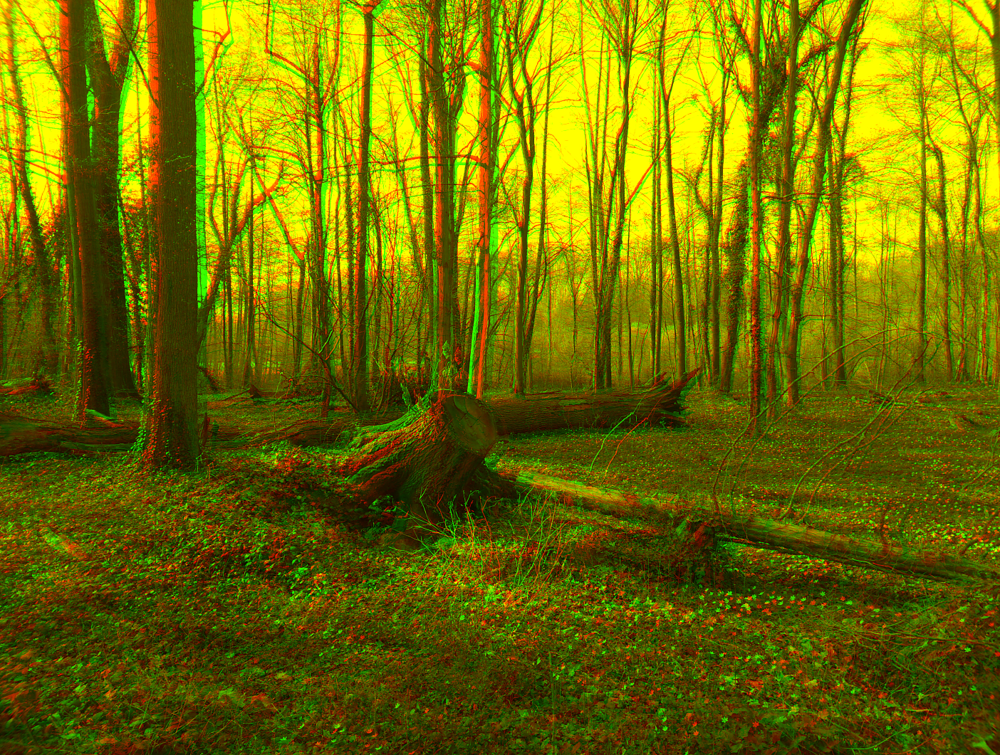

# Editor for Stereoscopy
This repository creates HTML5 WebApp (AppLSAC) for generation of stereoscopy and anaglyph images created for a Wikiversity learning resource about Stereoscopy. VR headset with an inserted smartphone can be used for stereoscopy images by splitting the screen in left eye and right eye. Anaglyph images can be generated with the AppLSAC too.

<h3>WebApp Demo: <a href="https://niebert.github.io/editor4stereoscopy" target="_blank">Editor for Stereoscopy</a></h3>

The editor for stereoscopy allows to load a left and right eye image and then align them properly for [stereoscopy 3D](https://en.wikiversity.org/wiki/Stereoscopy) perception or [Anaglyph 3D](https://en.wikiversity.org/wiki/Anaglyph_3D) images.

### Example Images to Learn Image Alignment with Editor4Stereoscopy
This repository contains [example images](https://github.com/niebert/editor4stereoscopy/tree/main/img/img4stereoscopy) to play with and learn the image alignment for [Anaglyph 3D](https://en.wikiversity.org/wiki/Anaglyph_3D) or [Stereocopy](https://en.wikiversity.org/wiki/Stereoscopy) images.

### Stereoscopy Image - Left/Right Eye
A stereoscopy image for the left and right eye. If you take a snapshot the left eye and the right eye image may not be align correctly. This stereoscopy editor as [AppLSAC](https://en.wikiversity.org/wiki/AppLSAC) allow the alignment for both images (see also https://en.wikiversity.org/wiki/Stereoscopy).

### Anaglyph - Left/Right Eye
An [Anaglyph 3D](https://en.wikiversity.org/wiki/Anaglyph_3D) uses color encoding (e.g. red and green) to separate the images for the left and right eye.
* Use the green filter for your left eye and
* Use the red filter for your left eye
to perceive the image in 3D.

## Folders in the Repository
* `js/` folder contains the Javascript files of the [WebApp](https://en.wikiversity.org/wiki/AppLSAC)
* `css/` folder contains all the style sheet files for the [WebApp](https://en.wikiversity.org/wiki/AppLSAC)
* `img/` contains all used images of the [WebApp](https://en.wikiversity.org/wiki/AppLSAC)
* `img/icons-svg` contains all icons as SVG files use in the [WebApp](https://en.wikiversity.org/wiki/AppLSAC)
* `img/img4stereoscopy` contains left and right eye images and anaglyph and stereoscopy results created with the [Editor4Stereoscopy](https://niebert.github.io/editor4stereoscopy)

## Used Libraries
* **[JQuery](https://jquery.com/)** `js/jquery.js`  URL: https://jquery.com - [License](https://jquery.com/license/): MIT
* **[LoadFile4DOM](https://www.gitlab.com/niehausbert/loadfile4dom)** `js/loadfile4dom.js` - URL: https://www.gitlab.com/niehausbert/loadfile4dom - Demo: https://niehausbert.gitlab.io/loadfile4dom - License: [MIT](https://www.gitlab.com/niehausbert/loadfile4dom)
* **[JSONEditor](https://www.github.com/niebert/json-editor)** `js/jsoneditor.js` URL: https://www.github.com/niebert/loadfile4dom - https://niebert.github.io/jsoneditor - Fork of [JSON-Editor by Jeremy Dorn](https://www.jeremydorn.com/json-editor)
* **[Bootstrap](https://github.com/twbs/bootstrap)** `js/bootstrap.js` License: MIT
