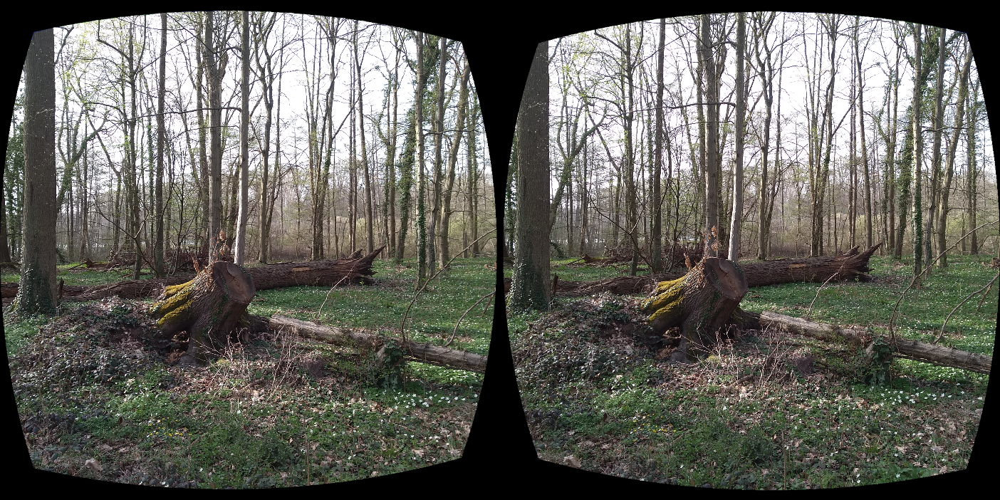
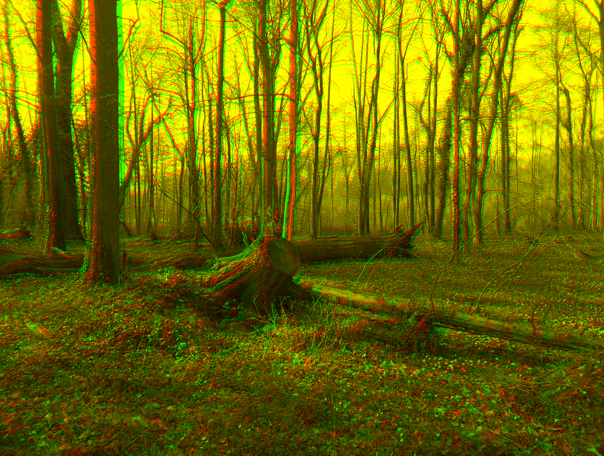

## Images for Left and Right Eye
This folder contains stereoscopy images for the left and right eye.

### Stereoscopy Image - Left/Right Eye
A stereoscopy image for the left and right eye. If you take a snapshot the left eye and the right eye image may not be align correctly. This stereoscopy editor as [AppLSAC](https://en.wikiversity.org/wiki/AppLSAC) allow the alignment for both images (see also https://en.wikiversity.org/wiki/Stereoscopy).

### Anaglyph - Left/Right Eye
An [Anaglyph 3D](https://en.wikiversity.org/wiki/Anaglyph_3D) uses color encoding (e.g. red and green) to separate the images for the left and right eye.

